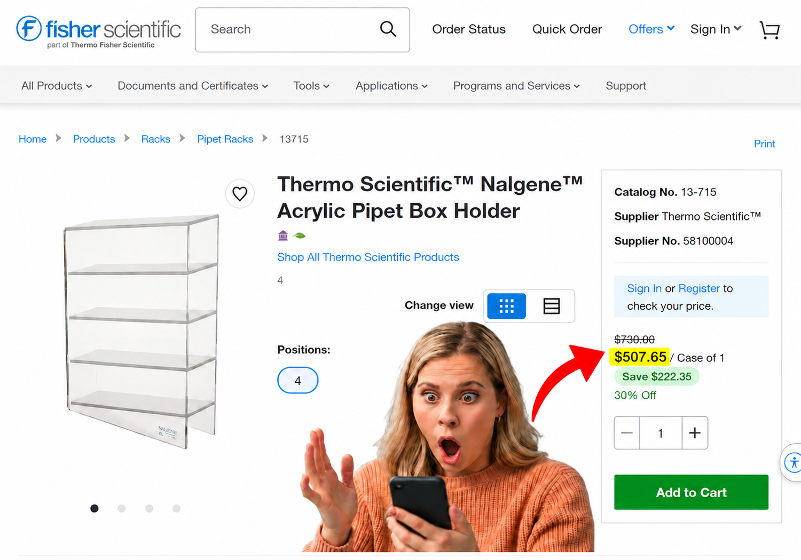
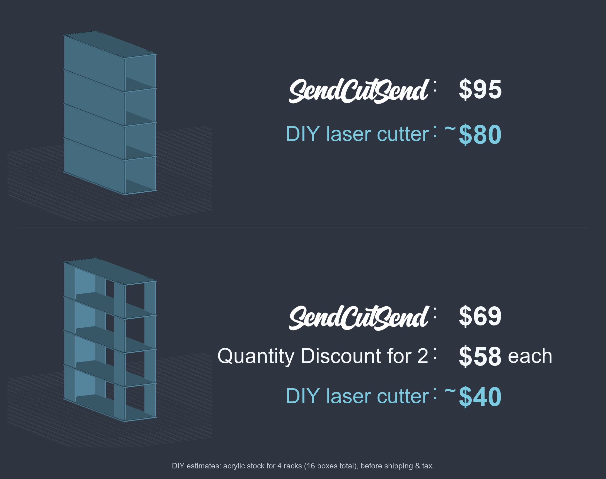

# Modular Acrylic Pipette Rack

Companies charge outrageous prices for equipment that scientists need to help people. This humble box project is small, but I hope it illustrates how AI can enable non-engineers like myself to quickly design products and make use of innovative companies like OSHCut and SendCutSend to reduce barriers for science.

It would be possible to create a 3D printable solution for ~$30 of filament. However, that requires a 3D printer and the hassle of managing multiple print jobs with a risk of failed prints. For not much added cost, this design eliminates that hassle and enables the use of on demand manufacturing services like OSH Cut or SendCutSend. If you have access to a laser cutter (for example through a shared University service), cost for acrylic material would be comparable to 3D printing.

This project offers two designs for the storage of serological pipettes. The solid design recreates existing storage solutions, and the column design was created to reduce material cost.
Two modular, laser-cut acrylic rack designs: **solid sides** and **corner
columns**. Stack identical compartments vertically while sharing one shelf at
each interface, instead of doubling the floor and ceiling. Designed for easy dry-fit assembly
and optimized for flat-pack shipping.

**[Download the solid CAD package](https://github.com/Diplomatt42/modular-acrylic-pipette-rack/releases/download/v1.1/solid_version_3mm_editable_CAD_package_v1.1.zip)**
| **[Download the column CAD package](https://github.com/Diplomatt42/modular-acrylic-pipette-rack/releases/download/v1.1/column_version_3mm_editable_CAD_package_v1.1.zip)**
| **[Release notes](https://github.com/Diplomatt42/modular-acrylic-pipette-rack/releases/tag/v1.1)**

Each download is a complete folder with CAD, editable source, configuration,
assembly notes and an AI handoff guide. You can use the delivered DXF/STEP files
without installing the generator.

> [!WARNING]
> Acrylic can craze or crack from alcohol-based cleaners, even in a dry-fit rack that doesn't use solvent welding.
> For regular alcohol cleaning, I strongly recommend a compatible polycarbonate
> or PETG grade instead. Verify the exact cleaner and fabrication process.
> See [solid guide](solid-version/MATERIALS_AND_CARE.md) or [column guide](column-version/MATERIALS_AND_CARE.md).

*The SendCutSend prices are supplied quotes. DIY prices in the image are estimated
acrylic stock totals for a batch of four complete racks (16 compartments), before
shipping and tax. They are not per-rack DIY prices. Get current quotes for the same
quantity and specifications when comparing fabrication options.*

## Choose a version

| | Solid sides | Corner columns |
|---|---|---|
| Side support per compartment | Two full panels | Four identical columns |
| Column width | Not applicable | 2.000 in / 50.8 mm |
| Unique production parts | Side panel, shelf, back | Column, shelf, back |
| Four-compartment quantities | 8 sides, 5 shelves, 4 backs | 16 columns, 5 shelves, 4 backs |
| Package | [solid-version/](solid-version/) | [column-version/](column-version/) |

## Dimensions and material

- Nominal material: 3 mm clear acrylic.
- Existing model thickness: 0.118 in / 2.9972 mm; customize to measured stock.
- Body width x depth: 3.500 x 11.500 in / 88.9 x 292.1 mm.
- One complete box height: 3.500 in / 88.9 mm, including both shelves.
- Clear compartment height: 3.264 in / 82.9056 mm.
- Shelf footprint: 3.750 x 11.625 in / 95.25 x 295.275 mm.
- Four-compartment overall height: 13.646 in / 346.6084 mm.
- For N compartments: N+1 shelves, N backs, and 2N sides or 4N columns.

The default laser profile assumes a 36 x 24-inch bed. Change it to match both your
actual usable laser bed and stock dimensions. DXFs use **inches**; STEP uses **mm**.

## Assemble

1. Put the first shelf flat on a level counter.
2. Insert two sides (or four columns) and one back; temporarily support the walls.
3. Cap the compartment with a second identical shelf.
4. Add the next walls onto that shared shelf and repeat.

Upper and lower wall tabs use offset slot sets, so they do not collide at shared
shelves. Follow the assembly model for front/back and top/bottom orientation.
Full instructions: [solid assembly](solid-version/ASSEMBLY.md) /
[column assembly](column-version/ASSEMBLY.md).

## Slot locations, edges and corner radii

Hole locations and deliberately non-flush shelf edges enable the tab-and-slot
joints. The shelves extend beyond the wall faces to leave material around their
slots. Offset upper/lower slot sets let the walls above and below a shared shelf
use different openings without their tabs colliding. These offsets are intentional;
do not center the holes or trim the shelves flush without redesigning the joints.

Slots are rectangular with small **0.381 mm (0.015 in) corner radii**, preserving
the v1.0 dimensions and fit. They do not have full semicircular ends. Small radii
avoid sharp internal corners; they do not guarantee freedom from stress fractures.
Side slots are 15.24 x 3.8862 mm; back slots are 12.192 x 3.8862 mm. The default
0.889 mm thickness clearance remains a locating slip fit; cut the fit coupon to
choose a closer positive clearance for your stock and machine.

## Customize, or hand the package to an AI agent

Start with `AI_HANDOFF.md` in the chosen version. Edit `design_parameters.json`
for dimensions and joints, and `laser_profile.json` for bed size and cut spacing.
The JSON inputs use mm, including the box height, actual stock thickness and fit
clearances. The generator recomputes the mating parts and shared-shelf stack.

Example request:

> Change the single-box overall height to 101.6 mm, keep the shared shelf system,
> and regenerate the one-box and four-compartment STEP models and production
> DXFs. Validate the CAD and report the new clear opening height.

The source uses Python, CadQuery and ezdxf. Setup and regeneration instructions
are in each package's README. Use a new output folder to preserve earlier revisions.

| Reference | Solid | Column |
|---|---|---|
| Editable inputs and instructions | [README](solid-version/README.md) | [README](column-version/README.md) |
| AI handoff | [AI_HANDOFF.md](solid-version/AI_HANDOFF.md) | [AI_HANDOFF.md](column-version/AI_HANDOFF.md) |
| Laser customization | [CUSTOMIZATION.md](solid-version/CUSTOMIZATION.md) | [CUSTOMIZATION.md](column-version/CUSTOMIZATION.md) |
| Three production DXFs | [cutting/](solid-version/generated/cutting/) | [cutting/](column-version/generated/cutting/) |
| Individual and assembled STEP | [models/](solid-version/generated/models/) | [models/](column-version/generated/models/) |

## Prototype status and validation

**CAD-validated prototype; physical testing is still needed.** No load rating or
unlimited safe stack height is claimed. The joints are gravity-assembled locating
slip fits; they do not positively retain the stack when lifted by its top.

The rack was designed to be modular, dry-fit together for easy assembly, and
optimized for flat-pack shipping. All production parts are flat sheet pieces that
can ship disassembled. Walls need temporary support until the next shelf is fitted.

If additional stability is needed, acrylic can be permanently solvent welded with
a compatible acrylic cement. Where permitted under approved lab controls,
methylene chloride and a needle applicator can be used at close-contact seams;
other acrylic cement formulations are available. Bonding prevents disassembly at
those joints. See the [solid](solid-version/MATERIALS_AND_CARE.md) or
[column](column-version/MATERIALS_AND_CARE.md) material guide for joint-gap guidance,
chemical precautions, and the [author's example cement link](https://a.co/d/034aoZOj).

Checks passed for closed DXF contours, solid geometry, assembly collisions, STEP
reimport, dimensions, part quantities and bed-layout spacing. The rewritten source
also reproduces the previously shared parts. The v1.1 documentation release
retains the v1.0 CAD geometry and confirms the small rounded slot corners in both
versions. Tested customizations include height
changes and changes to stock thickness, clearance, bed size and compartment count.

Cut a fit coupon with your stock and settings, then prototype one compartment.
DXFs describe finished geometry; apply kerf compensation once in your laser CAM.
Changing the modeled thickness alone does not calibrate your laser.

See each version's `BASELINE_CHECK.json` and `generated/validation_report.json`
for the actual checks. Local nested drawings are separate from the individual
supplier DXFs and do not guarantee the fewest possible sheets.

## License and credit

Original project material is licensed under **[CC BY 4.0](https://creativecommons.org/licenses/by/4.0/)**.
You can use, modify and redistribute it, including commercially, with attribution,
a license link and an indication of changes. Copyright is retained to the extent
it applies. See [LICENSE](LICENSE) and [ATTRIBUTION.md](ATTRIBUTION.md).

Third-party libraries and the SendCutSend logo/trademarks retain their own rights.
This project is not affiliated with or endorsed by SendCutSend.

## Feedback and contributions

Open an issue with your variant, stock thickness, machine/setup, changed parameters
and the problem encountered. If you submit improved geometry or instructions,
include matching source/input changes and regenerated validation results.
